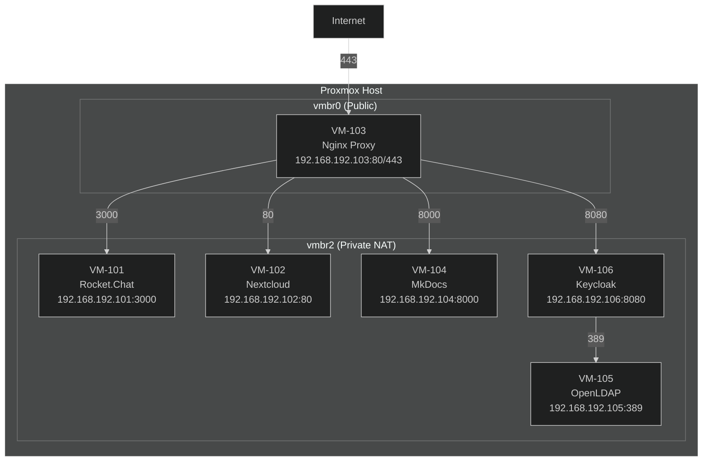

# VM Creation Overview

Brief description: Plan and document your six virtual machines before creation.

## What You'll Learn

- VM specifications and requirements
- Network planning
- IP address documentation

## Virtual Machine Specifications

| VM | Name | VM ID | CPU | RAM | Disk | Purpose |
|----|------|-------|-----|-----|------|---------|
| VM-1 | rocketchat | 101 | 2 vCPU | 4 GiB | 30 GiB | Rocket.Chat server |
| VM-2 | nextcloud | 102 | 2 vCPU | 6 GiB | 50 GiB | Nextcloud server |
| VM-3 | nginx-proxy | 103 | 1 vCPU | 2 GiB | 10 GiB | Reverse proxy |
| VM-4 | mkdocs | 104 | 1 vCPU | 2 GiB | 10 GiB | Documentation server |
| VM-5 | openldap | 105 | 1 vCPU | 2 GiB | 10 GiB | LDAP directory |
| VM-6 | keycloak | 106 | 2 vCPU | 4 GiB | 20 GiB | SSO/IdP server |

## IP Address Inventory Template

Copy this table and fill in your actual IP addresses as you create each VM:

### Network Configuration

Based on your [network setup](../01-preparation/03-network-configuration.md):
- **vmbr0**: Public network (direct internet access) - for Nginx Proxy only
- **vmbr2**: Private internal network (192.168.192.0/18 with NAT) - for all other VMs

### Your Infrastructure IP Table

| VM Name | VM ID | Bridge | Internal IP | Public Domain | Services |
|---------|-------|--------|-------------|---------------|----------|
| rocketchat | 101 | vmbr2 | `___` | chat.example.com | Rocket.Chat Port 3000 |
| nextcloud | 102 | vmbr2 | `___` | cloud.example.com | Nextcloud Port 80/443 |
| nginx-proxy | 103 | vmbr0 | `___` | proxy.example.com | Nginx Port 80/443 |
| mkdocs | 104 | vmbr2 | `___` | docs.example.com | MkDocs Port 8000 |
| openldap | 105 | vmbr2 | `___` | ldap.example.com | LDAP Port 389/636 |
| keycloak | 106 | vmbr2 | `___` | auth.example.com | Keycloak Port 8080 |

### Example (Filled)

| VM Name | VM ID | Bridge | Internal IP | Public Domain | Services |
|---------|-------|--------|-------------|---------------|----------|
| rocketchat | 101 | vmbr2 | 192.168.192.101 | chat.example.com | Rocket.Chat Port 3000 |
| nextcloud | 102 | vmbr2 | 192.168.192.102 | cloud.example.com | Nextcloud Port 80/443 |
| nginx-proxy | 103 | vmbr2 | 192.168.192.20 | proxy.example.com | Nginx Port 80/443 |
| mkdocs | 104 | vmbr2 | 192.168.192.104 | docs.example.com | MkDocs Port 8000 |
| openldap | 105 | vmbr2 | 192.168.192.105 | ldap.example.com | LDAP Port 389/636 |
| keycloak | 106 | vmbr2 | 192.168.192.106 | auth.example.com | Keycloak Port 8080 |

## Network Architecture


```mermaid
%%{init: {'theme': 'dark'}}%%
graph TB
    subgraph "Proxmox Host"
        subgraph "vmbr0 (Public)"
            VM3[VM-103<br/>Nginx Proxy<br/>192.168.192.103:80/443]
        end
        subgraph "vmbr2 (Private NAT)"
            VM1[VM-101<br/>Rocket.Chat<br/>192.168.192.101:3000]
            VM2[VM-102<br/>Nextcloud<br/>192.168.192.102:80]
            VM4[VM-104<br/>MkDocs<br/>192.168.192.104:8000]
            VM5[VM-105<br/>OpenLDAP<br/>192.168.192.105:389]
            VM6[VM-106<br/>Keycloak<br/>192.168.192.106:8080]
        end
    end
    
    Internet -->|443| VM3
    VM3 -->|3000| VM1
    VM3 -->|80| VM2
    VM3 -->|8080| VM6
    VM3 -->|8000| VM4
    VM6 -->|389| VM5
```

## Prerequisites

- [ ] Proxmox VE installed and accessible
- [ ] ZFS storage pool `rpool` visible in Proxmox
- [ ] Ubuntu Server 24.04 LTS ISO uploaded (see below)
- [ ] Network bridges `vmbr0` and `vmbr2` configured (see [Network Configuration](../01-preparation/03-network-configuration.md))

## Upload Ubuntu ISO

Before creating VMs, upload the Ubuntu ISO:

1. Download Ubuntu Server 24.04 LTS:
   ```bash
   # From your local machine
   wget https://releases.ubuntu.com/24.04/ubuntu-24.04-live-server-amd64.iso
   ```

2. In Proxmox Web UI:
   - Navigate to **Datacenter** → **Storage** → **local**
   - Click **ISO Images**
   - Click **Upload**
   - Select the downloaded ISO file
   - Wait for upload to complete

3. Verify upload:
   - ISO should appear in the ISO Images list
   - Size should be approximately 2GB

## Creation Strategy

### Recommended Order

1. **VM-103 (Nginx Proxy)** - Create first for early testing
2. **VM-101 (Rocket.Chat)** - Core communication service
3. **VM-102 (Nextcloud)** - File sharing service
4. **VM-106 (Keycloak)** - Identity management
5. **VM-105 (OpenLDAP)** - Directory services
6. **VM-104 (MkDocs)** - Documentation (can be created anytime)

### Alternative: Create All at Once

You can also create all VMs in one session, then install Ubuntu on each sequentially.

## Verification Checklist

Before proceeding to individual VM creation:

- [ ] Ubuntu 24.04 LTS ISO uploaded to Proxmox
- [ ] IP address plan documented
- [ ] Sufficient storage space in ZFS pool (minimum 130GB total)
- [ ] Network bridges `vmbr0` and `vmbr2` configured
- [ ] Proxmox Web UI accessible

## Time Estimate

- **Planning**: 15-30 minutes
- **Creating all VMs**: 2-3 hours
- **Installing Ubuntu on each**: 2-3 hours
- **Total Day 2**: 4-5 hours

## Common Issues

### Issue: Not enough storage space
**Solution**: Check ZFS pool capacity:
```bash
zpool list
```

### Issue: Cannot upload ISO
**Solution**: 
- Verify storage location has enough space
- Try alternative upload method via command line
- Check browser console for errors

### Issue: Network bridge not configured
**Solution**: 
- Check network configuration in Datacenter → Node → Network
- Ensure both vmbr0 (public) and vmbr2 (private/NAT) are configured
- See [Network Configuration](../01-preparation/03-network-configuration.md) for setup details

## Next Steps

Choose your first VM to create:
- [Rocket.Chat VM](02-rocketchat-vm.md) - VM-101
- [Nextcloud VM](03-nextcloud-vm.md) - VM-102
- [Nginx Proxy VM](04-nginx-proxy-vm.md) - VM-103
- [MkDocs VM](05-mkdocs-vm.md) - VM-104
- [LDAP VM](06-ldap-vm.md) - VM-105
- [Keycloak VM](07-keycloak-vm.md) - VM-106

Or create all VMs following the same pattern for each.
