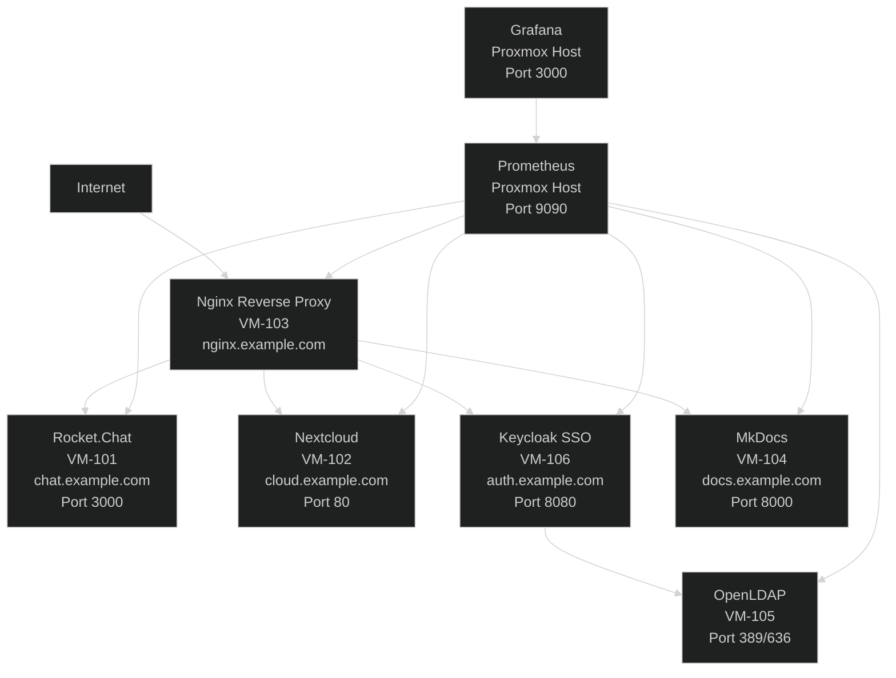

# Proxmox Lab Infrastructure Training

Welcome to the comprehensive 15-day infrastructure training project. This documentation will guide you through building a complete enterprise infrastructure from bare metal to production-ready services.

## What You'll Learn

This training covers the complete lifecycle of modern infrastructure deployment:

- **Virtualization & Storage**: Proxmox VE with ZFS storage pools
- **Identity Management**: OpenLDAP directory services with Keycloak SSO
- **Collaboration Tools**: Rocket.Chat and Nextcloud deployment
- **Security**: CIS benchmark hardening, firewalls, and intrusion prevention
- **Monitoring**: Prometheus and Grafana observability stack
- **Documentation**: MkDocs for knowledge management

## Training Timeline

| Day | Topic | Duration |
|-----|-------|----------|
| 1 | Rescue mode, ZFS setup, Proxmox installation | 4-6 hours |
| 2 | Create 6 virtual machines | 4-5 hours |
| 3 | Rocket.Chat installation | 3-4 hours |
| 4 | Nextcloud installation | 3-4 hours |
| 5 | Nginx reverse proxy and SSL | 4-6 hours |
| 6 | OpenLDAP server setup | 3-4 hours |
| 7 | Keycloak installation and realm setup | 4-5 hours |
| 8 | OIDC integration for SSO | 3-4 hours |
| 9 | CIS hardening | 6-8 hours |
| 10 | Firewall, Fail2Ban, and backups | 4-5 hours |
| 11 | Prometheus and Grafana monitoring | 4-5 hours |
| 12 | MkDocs documentation server | 3-4 hours |
| 13 | Security audits | 4-5 hours |
| 14 | Final testing and validation | 4-5 hours |
| 15 | Advanced topics (optional) | Variable |

## Prerequisites

Before starting, ensure you have:

- Hetzner EX44 server (or equivalent with 2x NVMe drives)
- Basic Linux command line knowledge
- SSH client installed
- Text editor (nano, vim, or VS Code)
- 15 days of dedicated time (4-6 hours per day)

## Quick Navigation

### Getting Started
1. [Prerequisites](prerequisites.md) - What you need before Day 1
2. [Rescue Mode](01-preparation/01-rescue-mode.md) - Begin Day 1

### Infrastructure Building
3. [VM Overview](02-vm-creation/01-overview.md) - Track your IP addresses
4. [Software Installation](03-software/01-rocketchat.md) - Deploy services

### Security & Operations
5. [Security Hardening](04-security/01-firewall.md) - Protect your infrastructure
6. [Monitoring Setup](05-monitoring/01-prometheus-grafana.md) - Observe everything
7. [Maintenance Procedures](06-maintenance/01-updates.md) - Keep it running

## Architecture Overview

## Technology Stack

| Category | Technology | Version |
|----------|------------|---------|
| Virtualization | Proxmox VE | 8.2 |
| Operating System | Ubuntu Server | 24.04 LTS |
| Container Runtime | Docker | 24.x |
| Chat Platform | Rocket.Chat | 6.x |
| File Sync | Nextcloud | 28.x |
| Identity Provider | Keycloak | 24.0.0 |
| Directory Services | OpenLDAP | 2.5.x |
| Reverse Proxy | Nginx | 1.24 |
| Monitoring | Prometheus | 2.51.0 |
| Visualization | Grafana | 10.x |
| Documentation | MkDocs | Latest |

## Important Notes

!!! warning "Production Use"
    This documentation uses `example.com` as a placeholder domain. Replace with your actual domain in production environments.

!!! caution "Data Safety"
    Several operations in this training involve disk partitioning and data destruction. Always verify you're working on the correct system before executing commands.

!!! tip "Documentation Format"
    Each document follows this pattern:
    1. Prerequisites checklist
    2. Step-by-step instructions
    3. Verification steps
    4. Daily completion checklist

## Support

For issues or questions:
- Review the [Troubleshooting Guide](reference/troubleshooting.md)
- Check [Common Commands](reference/commands.md)
- Refer to specific technology documentation

## Next Steps

Ready to begin? Start with [Prerequisites](prerequisites.md) to ensure you have everything needed, then proceed to [Day 1 - Rescue Mode](01-preparation/01-rescue-mode.md).
